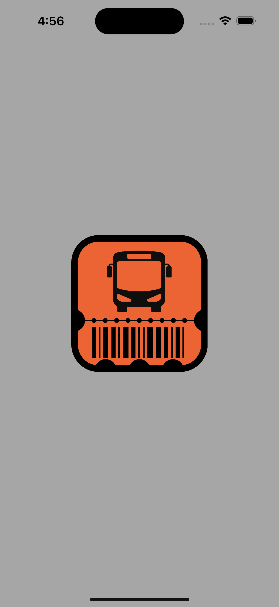
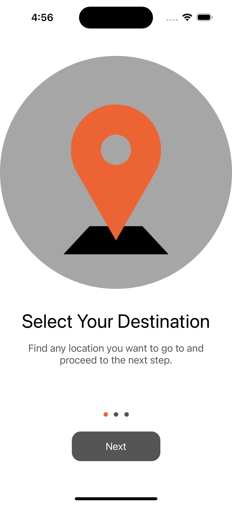
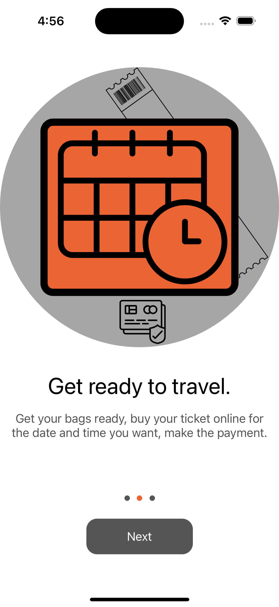
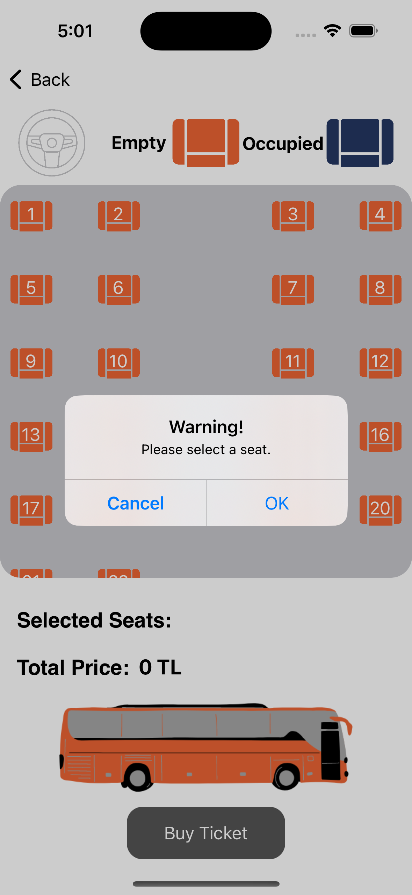
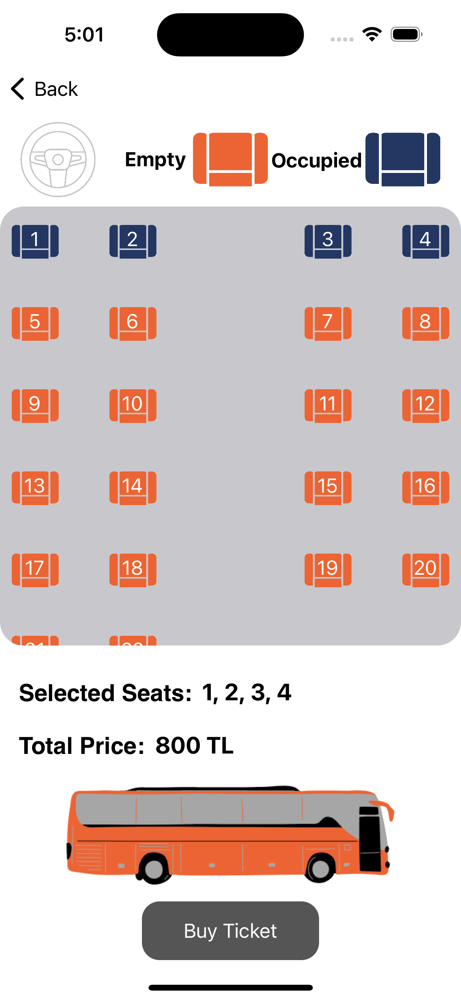
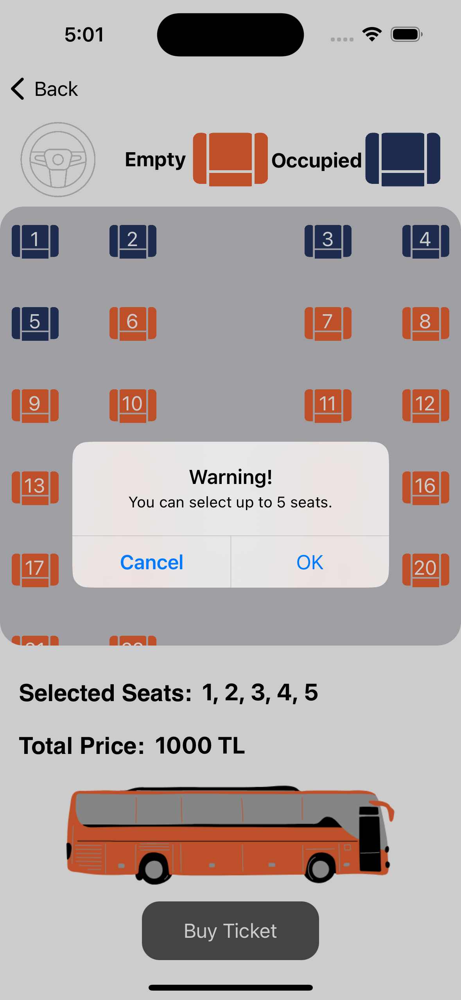
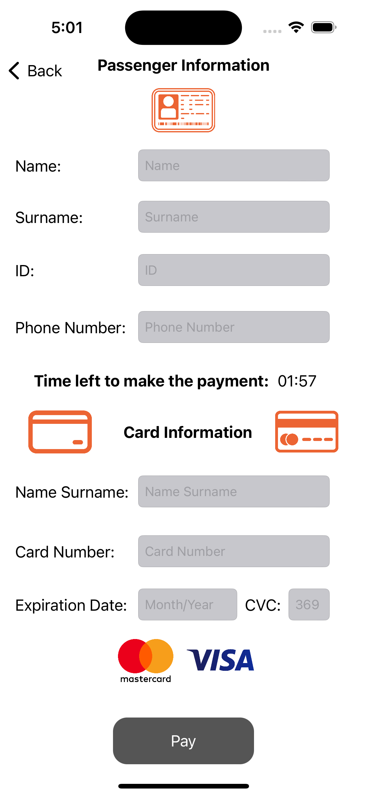
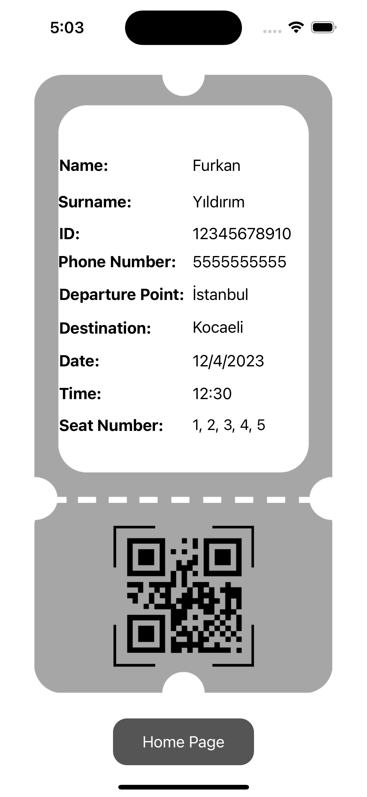

# Bus Ticket App 

Bu uygulama, otobüs biletleri satın almak ve yönetmek için kullanılabilir.

## Özellikler

- Otobüs seferleri listeleme
- Otobüs seferi arama
- Otobüs bilet satın alma
- Koltuk seçimi
- Satın alınan biletlerin listesi

## Kullanım

- Ana sayfada otobüs seferlerini listeleyin veya arama yaparak seferleri filtreleyin.
- Bir seçim yaptıktan sonra, sefer detayları sayfasına yönlendirilirsiniz.
- Sefer detayları sayfasında, bilet sayısı ve koltuk seçimi yapabilirsiniz.
- Koltuk seçiminde tamamlandıktan sonra, ödeme sayfasına yönlendirileceksiniz.
- Ödeme işlemini tamamladıktan sonra, biletiniz onaylanacak.
- Biletlerim sayfasında, satın alınan biletlerin bir listesini görebilirsiniz. Burada bilet iptal işlemi de gerçekleştirebilirsiniz.

## Gereksinimler

- Xcode 11 veya üstü
- iOS 13 veya üstü
- Swift 5

## Uygulama İçi Resimler

